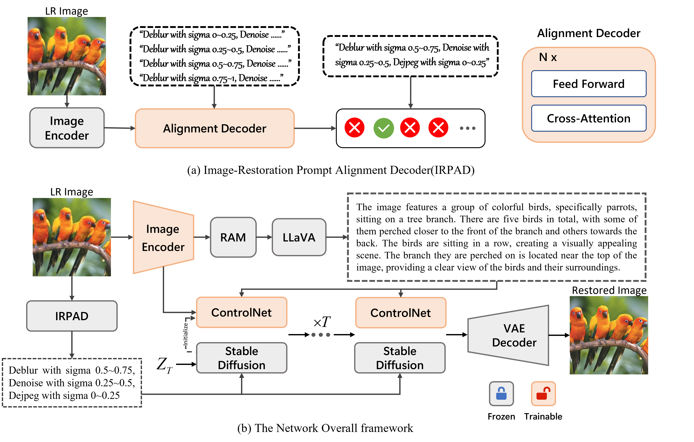

# DaLPSR: Leverage Degradation-Aligned Language Prompt for Real-World Image Super-Resolution

[Paper](https://arxiv.org/pdf/2406.16477)
<a href='https://arxiv.org/pdf/2406.16477'></a> &nbsp;&nbsp;

## Overview framework


Image super-resolution pursuits reconstructing high-fidelity high-resolution counterpart for low-resolution (LR) image. In recent years, diffusion-based models have garnered significant attention due to their capabilities with rich prior knowledge. The success of diffusion models based on general text prompts has validated the effectiveness of textual control in the field of text2image. However, given the severe degradation commonly presented in low-resolution images, coupled with the randomness characteristics of diffusion models, current models struggle to adequately discern semantic and degradation information within severely degraded images. This often leads to obstacles such as semantic loss, visual artifacts, and visual hallucinations, which pose substantial challenges for practical use. To address these challenges, this paper proposes to leverage degradation-aligned language prompt for accurate, fine-grained, and high-fidelity image restoration. Complementary priors including semantic content descriptions and degradation prompts are explored. Specifically, on one hand, image-restoration prompt alignment decoder is proposed to automatically discern the degradation degree of LR images, thereby generating beneficial degradation priors for image restoration. On the other hand, much richly tailored descriptions from pretrained multimodal large language model elicit high-level semantic priors closely aligned with human perception, ensuring fidelity control for image restoration. Comprehensive comparisons with state-of-the-art methods have been done on several popular synthetic and real-world benchmark datasets. The quantitative and qualitative analysis have demonstrated that the proposed method achieves a new state-of-the-art perceptual quality level, especially in real-world cases based on reference-free metrics.

## Visual Examples


## Installation
1. Clone this Repo and Create Conda Environment and Install Package
```
## git clone this repository
git clone https://github.com/puppy210/DaLPSR.git
cd DalPSR

# create an environment with python >= 3.9
conda create -n DalPSR python=3.9
conda activate DalPSR
pip install --upgrade pip
pip install -r requirements.txt
```

2. Download Pre-trained Models
    #### Pre-trained Models:
    * `stable-diffusion-2-base`: [stable-diffusion-2-base](https://huggingface.co/stabilityai/stable-diffusion-2-base/tree/main)
    * `RAM`: [RAM-Swin-Large-14M](https://huggingface.co/spaces/xinyu1205/recognize-anything/blob/main/ram_swin_large_14m.pth)
    * `LLaVA`: [LLaVA](https://github.com/haotian-liu/LLaVA)

## Citations
If our paper helps your research or work, please consider citing our paper. The following are BibTeX references:
```bibtex
@article{jiang2024dalpsr,
  title={DaLPSR: Leverage Degradation-Aligned Language Prompt for Real-World Image Super-Resolution},
  author={Jiang, Aiwen and Wei, Zhi and Peng, Long and Liu, Feiqiang and Li, Wenbo and Wang, Mingwen},
  journal={arXiv preprint arXiv:2406.16477},
  year={2024}
}
```

## Acknowledgments
Some code is sourced from [SUPIR](https://github.com/Fanghua-Yu/SUPIR) and [SeeSR](https://github.com/cswry/SeeSR). We appreciate their excellent work.
